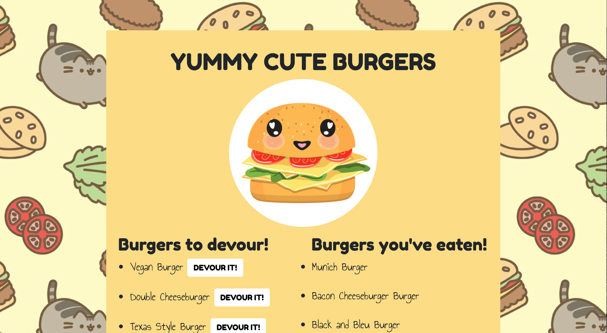
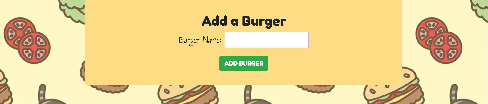

<h1>Yummy Cute Burger App</h1>

<h2>What is it?</h2>
A full stack development project utilizing the MVC design pattern. Features an original ORM and model. Node and MySQL are used to query and route data in the app. Handlebars generates the HTML.

<h2>Built With</h2>
<ul>
  <li>Handlebars</li>
  <li>CSS</li>
  <li>Bootstrap</li>
  <li>JavaScript</li>
  <li>jQuery</li>
  <li>Node.js</li>
  <li>MySQL</li>
  <li>MAMP</li>
  <li>Google Fonts</li>
</ul>

<h2>Required NPM Packages</h2>
<ul>
  <li>Express</li>
  <li>Express Handlebars</li>
  <li>Body Parser</li>
  <li>MySQL</li>
  <li>Dotenv</li>
</ul>

<h2>How does it work?</h2>
Click the DEVOUR IT button to eat the burger. This moves the burger from the "Burgers to devour" column to the "Burgers you've eaten" column. You can add more burgers to the menu using the form at the bottom of the page. When you click ADD BURGER, your new burger will appear in the "Burgers to devour" column.

<h2>Link</h2>
Check it out for yourself using the link below!
https://sheltered-lake-45162.herokuapp.com/
